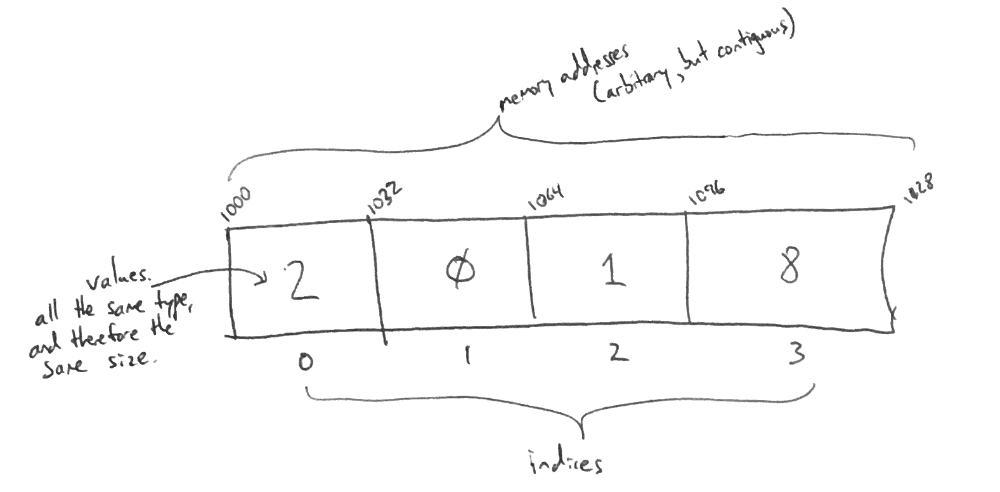

# Array

An array is a collection of values in which each element is identified by an index.

# In Memory

In memory, an array looks like this:



In the above diagram, each position in the array has a value, an index and a memory address.

- Indices increase by 1 as they ascend in position, but start at 0.
- Memory addresses above are arbitrary, but contiguous.
- Values are always of the same type in statically typed languages

# Operations

An array supports the following operations:

- **retrieval/access/read**: obtain a value stored in the structure at a specific indexed position in the array.
  - O(1), constant time. An array variable really just records the base address of the array, so we know the exact memory address of the beginning of the array. We also know the data type of the elements in the array, and therefore the size of each element. Given the index of an element we wish to read, we can calculate the address of that element in _one step_: base address + sizeof(datatype) \* index. Since we can calculate this in one step for all values in the array, this is an O(1) constant time operation.
- **search**: find a value stored in the structure and determine the indexed position in the array.
  - O(n), linear time. There is no way to find a specific value in an array without iterating through the entire array (unless the array is sorted). Given the value we would like to find, we must iterate through each element in the array until finding the position of the value. Therefore, on average, this is a linear O(n) operation.
- **insertion**: insert an element at a given index in the array.
  - O(n), linear time. When inserting into an array, each element to the left of to-be-inserted position must be shifted over one position to the right to make room for the new element (see diagram). Therefore, on average, the algorithm will need to shift over 'n' elements making the process an O(n) operation.
- **deletion**: deleting an element at a given index in the array.
  - O(n), linear time. This operation is very similar to the insertion operation. When deleting an element, the value at the index position is deleted, and all elements to the right are shifted one position to the left. On average, 'n' elements need to be shifted making this an O(n) operation.

# Use Cases

An array is useful when random access is important. Arrays are valuable data structures when an element needs to be found through its index quickly. They are also great for small data items such as characters because arrays are very efficient in memory.

It is not as good when constant time insertion / deletion is important or when fast searching of integers is required.

# Example

```
Sample code is written in Python:

myList = [9, 4, 7, 1, 2]

four = myList[1] - retrieval/access/read
myList.index(7) - searches for the value 7 and returns the index
myList.insert(2, 12) - inserts the value 12 into index 2
del myList[2] - deletes the value in position 2 of myList
```

(c) 2018 Francesco Aiello. All rights reserved.
