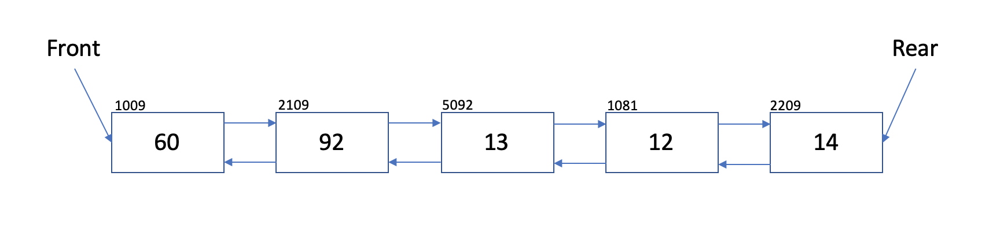

# Deque

A Deque is a double ended queue that supports insertion and deletion on both ends.

# In Memory

In memory, a deque, implemented as a doubly linked list looks like this:



In this implementation of a deque, a doubly linked list is used (can also be implemented as an array). There is a front and rear of the deque and each element is connected in both directions.

# Operations

A deque supports the following operations:

- **get(access) front/rear**: accesses / gets the item at the front or rear of the deque.
  - O(1), constant. The front and rear of the deque are always stored. Therefore, random access to the first or last element is always O(1).
- **enque(insert) front/rear**: adds an element to either the front or rear of the deque.
  - O(1), constant. When inserting a new element to either the front or the rear of a deque, the process is the same as standard insertion into a doubly linked list. At the given position, the previous and next node's next and previous are updated to match the inserted node. And, the inserted node's next and previous are updated to match the position. Therefore, this always takes the same computation regardless of the size of the deque.
- **deque(remove) front/rear**: removes an element from either the front or rear of the deque.
  - O(1), constant. Similar to insertion, deleting an element from the deque follows a similar process. Like that of a doubly linked list, at the given position, the algorithm changes the node to be deleted's previous and next node's previous and next to match the updated deque.
- **isEmpty**: returns a boolean value for whether the deque is empty.
  - O(1), constant. This is a constant time operation. The first or last element are checked to see if they exist. If so, it is not empty.

# Use Cases

A deque is useful when a double-ended queue is necessary. For example, browser history. As new websites are added to the front of the history, older ones may be removed from the rear.

It is not as useful when insertion/removal at both ends is not necessary. In a case such as this one, a standard queue would be more fitting.

# Example

```
myDeque = Deque()
myDeque.append(50) #appends to the right end of the deque
myDeque.append_left(60) #appends to the left end of the deque
myDeque.pop() #removes a value from the right end of the deque
myDeque.is_empty() #checks if the deque is empty
myDeque.popleft() #removes a value from the left end of the deque
```

(c) 2018 Francesco Aiello. All rights reserved.
