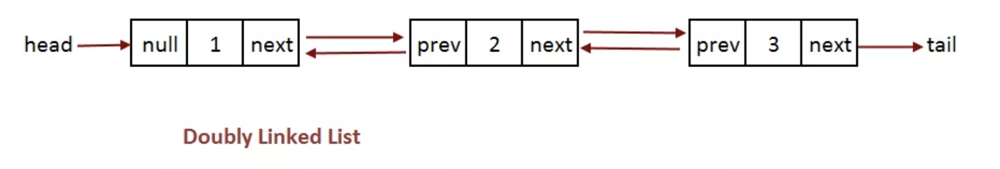

# Doubly Linked List

A doubly linked list is a collection of nodes that connect to one another in both directions.

# In Memory

In memory, a doubly linked list looks like this:



Each node as a value and a link to the previous and next node. The beginning is called the head and the end is called the tail.

# Operations

A doubly linked list supports the following operations:

- **retrieval/access/read**: obtain a value stored in a doubly linked list.
  - O(n), linear efficiency. The process of retrieving a value from a doubly linked list is linear because the algorithm will always need to search from the head or tail. It moves to the next node and checks the value, often recursively. Therefore, for 'n' nodes, the efficiency is O(n).
- **search**: search for a value stored in a doubly linked list.
  - O(n), linear efficiency. Similar to retrieval, the algorithm always starts at the head or tail and searches through linearly checking each value. Therefore, for 'n' nodes, the efficiency is O(n).
- **insertion**: insert a value at a given position in a doubly linked list.
  - O(1), constant time. Inserting into a linked list is constant efficiency. At the given position, the previous and next node's next and previous are updated to match the inserted node. And, the inserted node's next and previous are updated to match the position.. Therefore, this always takes the same computation regardless of the size of the list.
- **deletion**: remove a value from a given position in a doubly linked list.
  - O(1), constant time. At the given position, the algorithm node to be deleted's previous and next node's previous and next to match the updated list.

# Use Cases

A doubly linked list is useful because insertion and deletion is performed quickly. An effective use of a doubly linked list would be in the implementation of a stack or queue.

It is not as good when searching/retrieval needs to be done frequently.

# Example

```
class DoubleList:
    def __init__(self):
        self.head = None
        self.previous = None
    def isEmpty(self):
        return self.head == None
    def add(self, item):
        temp = Node(item, None, None)
        temp.setNext(self.head)
        temp.setPrevious(self.previous)
        self.head = temp
        self.previous = temp
    def length(self):
        current = self.head
        count = 0
        while current != None:
            count = count + 1
            current = current.getNext()
        return count
    def search(self, item):
        current = self.head
        found = False
        while current != None and not found:
            if current.getData() == item:
                found = True
            else:
                current = current.getNext()

        return found
    def remove(self, item):
        current = self.head
        previous = self.previous
        found = False
        while not found:
            if current.getData() == item:
                found = True
            else:
                previous = current.getPrevious()
                current = current.getNext()
        if previous == None:
            self.head = current.getNext()
        else:
            previous.setNext(current.getNext())
            self.indexUpdate()
    def append(self, item):
        newnode = Node(item, self.head, None)
        current = self.head
        if current== None:
            newNode.setPrevious = self.head
        else:
            temp = None
            while newnode.getNext() != None:
                temp = newnode.getNext()
            newnode.setNext(temp)
    def index(self, item):
        current = self.head
        while current != None:
            if current.data == item:
                return current.position
            else:
                current = current.next
    def indexUpdate(self, value): #updates the position after doing an operation such as inserting
        position = 0
        while value != None:
            value.position = position
            position += 1
            value = value.next
    def insert(self, item, position):
        if position == 0:
            self.add(item)
        #elif position == self.length()
            #self.append(item)
        else:
            temp = Node(item, None, None, position)
            current = self.head
            previous = None
            while current.position != position:
                previous = current
                current.position = current.next
            previous.next = temp
            temp.next = current
            temp.previous = previous
            current.previous = temp
            current = self.head
            self.indexUpdate(current)


class Node:
    def __init__(self, initdata, next, previous, position=0):
            self.data = initdata
            self.next = None
            self.previous = None
            self.position = position
    def getData(self):
        return self.data
    def getNext(self):
        return self.next
    def getPrevious(self):
        return self.previous
    def setData(self, newdata):
        self.data = newdata
    def setNext(self, newnext):
        self.next = newnext
    def setPrevious(self, newprevious):
        self.previous = newprevious


l = DoubleList()
l.add(50)
l.append(10)
print(l.index(5))
```

(c) 2018 Francesco Aiello. All rights reserved.
