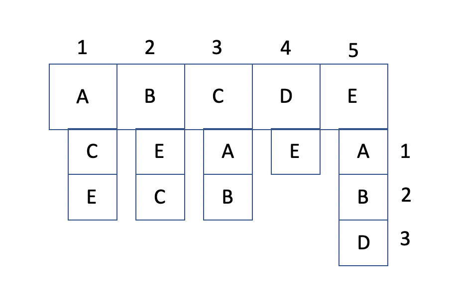

# Graph

A graph is a data structure consisting of nodes and edges. The structure is also non-linear.

# In Memory

In memory, a graph looks like this:



In memory, a graph is generally made up of an adjacency list. This is often represented as an array of arrays.

# Operations

A graph supports the following operations:

- **add vertex/edge**: add a vertex or edge to the graph.
  - O(1), constant. Adding an edge or vertex is an O(1) operation because inserting a new vertex or edge consists of adding to the respective spot in the array, which is a constant time operation.
- **search**: traversing through the graph for a particular element.
  - O(V + E), where V is the number of vertices and E is the number of edges. There are two main methods of traversing a graph. Breadth First Search and Depth First Search. They both work in a very similar way and one can be more efficient than the other depending on the situation. However, the complexity is due to traversal depending on the number of vertices and edges.
- **remove vertex/edge**: remove a vertex or edge from the graph.
  - Removing a vertex is O(V) and removing an edge is O(E). This is because, to remove a vertex or edge, first the value must be found in the structure. In this implementation as an adjacency list, the algorithm must iterate over each vertex/edge until it finds the to-be-deleted node, resulting in an O(V) or O(E) operation.

# Use Cases

A graph is useful when a collection of points need to be connected in various ways and when algorithms to find the fastest path may be necessary. For example, navigation on a map application could be implemented as a graph. Another example is a social network, where 'friends' are connected in a bidirectional relationship.

It is not as good when nodes have 2 connections at most. A binary situation such as this one would be better represented as a binary search tree.

# Example

```
my_graph = Graph()
my_graph.addVertex("cat")
my_graph.addVertex("dog")
my_graph.addEdge("cat", "dog")
my_graph.removeEdge("cat", "dog")
my_graph.removeVertex("cat")
```

(c) 2018 Francesco Aiello. All rights reserved.
