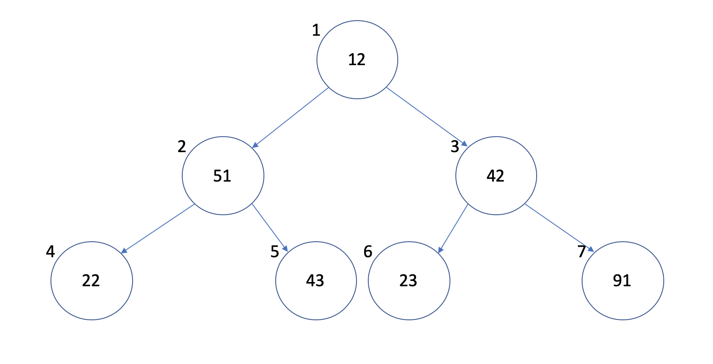

# Priority Queue

A priority queue is an extension of a [queue](queue.md), but items are given a priority. Items with a higher priority dequeued before items with a lower priority.

# In Memory

In memory, a priority queue looks like this:



A popular method of implementing a priority queue because is as a binary heap. It provides better performance than a linked list or array.

# Operations

A priority queue supports the following operations:

- **insert**: inserts an item with an assigned priority.
  - O(log(n)), logarithmic. Insertion in the priority queue, implemented as a binary heap, allows for insertion at O(log(n)) time. Initially, the element is inserted at the bottom of the heap, and priority comparisons are performed going up the heap, swapping as necessary.
- **get highest priority**: returns the item with the highest priority.
  - O(1), constant. The highest priority item is always at the top of the heap. Therefore, it is an O(1) operation to check the element.
- **delete highest priority**: deletes the item with the highest priority.
  - O(log(n)), logarithmic. The root is removed and the heap is restored by trickling down. Meaning, replace the root with the last element on the last level. Compare the new root with its children, swapping as necessary. This process is logarithmic.

# Use Cases

A priority queue is useful in a queue when priority is needed. A real-world example would be an emergency room. Patients are labeled with a priority depending on the degree of injury, and are treated based on the priority queue.

It is not as good when priority is unnecessary or another type of queue would be more effective.

# Example

```
my_queue = PQ()
my_queue.insert_with_priority(50, 1)
my_queue.insert_with_priority(62, 2)
my_queue.insert_with_priority(70, 3)
my_queue.insert_with_priority(90, 4)
my_queue.pull_highest_priority_element()
my_queue.get_highest_priority()
>>> 50
```

(c) 2018 Francesco Aiello. All rights reserved.
