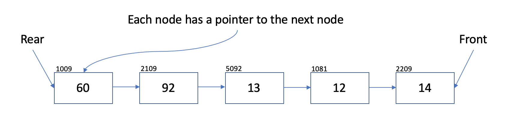

# Queue

A queue is a FIFO (first in first out) data structure.

# In Memory

In memory, a queue looks like this:



In this implementation of a queue, a singly linked list is utilized. The front of the queue is what would be the rear of the linked list. Each node has a pointer to the next.

# Operations

A queue supports the following operations:

- **enqueue**: adding a new element to the back of the queue.
  -O(1), constant time. The enqueue function adds a new element to the rear of the queue. This is an O(1) operation because it follows the same steps as a linked list insert.
- **dequeue**: removing an element from the front of the queue.
  - O(1), constant time. Like the enqueue function above, the removal of an element from the front of the queue is a constant time operation because it follows the same steps as a singly linked list removal.

# Use Cases

An is useful when items need to be organized in a FIFO way. A real-world use case is a queue to enter a website during a very high-traffic time.

It is not as good when FIFO organization is not necessary.

# Example

```
my_queue = Queue()
my_queue.enqueue(50)
my_queue.enqueue(61)
my_queue.dequeue()
>>> 50
my_queue.dequeue()
>>> 61
```

(c) 2018 Francesco Aiello. All rights reserved.
