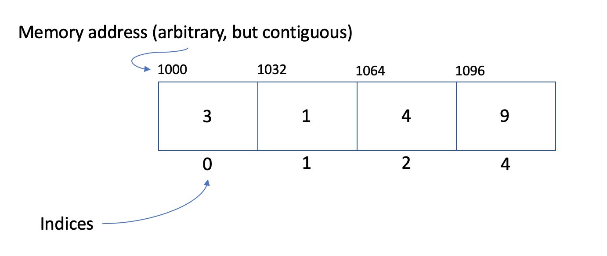

# Set

A set is an unordered collection of items that has no duplicate elements.

# In Memory

In memory, a set looks like this:



In the above diagram, each position in the set has a value, an index and a memory address.

- Indices increase by 1 as they ascend in position, but start at 0.
- Memory addresses above are arbitrary, but contiguous.

# Operations

A set supports the following operations:

- **retrieval/access/read**: obtain a value stored in the structure at a specific indexed position in the set.
  - O(1), constant time. A set variable really just records the base address of the set, so we know the exact memory address of the beginning of the set. We also know the data type of the elements in the set, and therefore the size of each element. Given the index of an element we wish to read, we can calculate the address of that element in _one step_: base address + sizeof(datatype) \* index. Since we can calculate this in one step for all values in the set, this is an O(1) constant time operation.
- **search**: find a value stored in the structure and determine the indexed position in the set.
  - O(n), linear time. There is no way to find a specific value in a set without iterating through the entire set (unless the set is sorted). Given the value we would like to find, we must iterate through each element in the set until finding the position of the value. Therefore, on average, this is a linear O(n) operation.
- **insertion**: insert an element at a given index in the set.
  - O(n), linear time. When inserting into a set, each element to the left of the to-be-inserted position must be shifted over one position to the right to make room for the new element (see diagram). Therefore, on average, the algorithm will need to shift over 'n' elements making the process an O(n) operation.
- **deletion**: deleting an element at a given index in the set.
  - O(n), linear time. This operation is very similar to the insertion operation. When deleting an element, the value at the index position is deleted, and all elements to the right are shifted one position to the left. On average, 'n' elements need to be shifted making this an O(n) operation.

# Use Cases

A set is useful when a collection of data must be stored with no duplicates.

It is not as good when data can have duplicates because this data structure does not support it.

# Example

```
my_set = {1, 2, 3, 4}
my_set.add(50)
print(my_set)
>>>(1, 2, 3, 4, 50)
```

(c) 2018 Francesco Aiello. All rights reserved.
