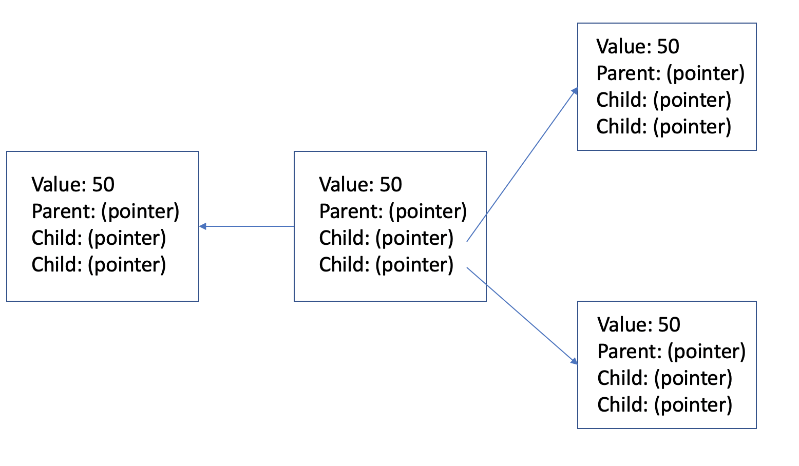

# \[Widget\]

A singly linked list is a collection of nodes that connect to one another in one direction from the head.

# In Memory

In memory, a singly linked list looks like this:



Each node as a value and the memory address of the next node, or in simpler words, a link. The beginning is called the head and the end is called the tail.

# Operations

A singly linked list supports the following operations:

- **retrieval/access/read**: obtain a value stored in a singly linked list.
  - O(n), linear efficiency. The process of retrieving a value from a singly linked list is linear because the algorithm will always need to search from the head. Starting from the head, it moves to the next node and checks the value. Therefore, for 'n' nodes, the efficiency is O(n).
- **search**: search for a value stored in a singly linked list.
  - O(n), linear efficiency. Similar to retrieval, the algorithm always starts at the head and searches through linearly checking each value. Therefore, for 'n' nodes, the efficiency is O(n).
- **insertion**: insert a value at a given position in a singly linked list.
  - O(1), constant time. Inserting into a linked list is constant efficiency. At the given position, the algorithm changes the previous node's 'next's previous to the inserted node. And, 'next' node to the node to be inserted. Therefore, this always takes the same computation regardless of the size of the list.
- **deletion**: remove a value from a given position in a singly linked list.
  - O(1), constant time. At the given position, the algorithm changes the previous node's 'next' node to the 'next' of the node to be deleted. And conversely, the 'previous' of the 'next' node to the original node's 'previous'.

# Use Cases

A singly linked list is useful when frequent insertions and deletions are performed.

It is not as good when searching is often needed due to the linear search complexity.

# Example

```
sample code showing creation, and exercising all of the operations
or
a program that doesn't use the structure, and then a version that does
```

(c) 2018 Francesco Aiello. All rights reserved.
