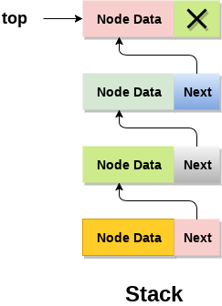

# Stack

A stack is a linear, last in first out (LIFO) data structure.

# In Memory

In memory, a stack looks like this:



The above diagram of stacks in memory is nearly identical to that of a linked list. A linked list is a common method of implementing a stack due to its O(1) insertion and O(1) deletion. In the diagram, each element in the stack has a value and a reference to the next element. In the above representation, the tail of the linked list is the top of the stack.

# Operations

A \[widget\] supports the following operations:

- **retrieval/access/read**: retrieving a value from a position within the stack.
  - O(n), linear time. Accessing/reading a value at a particular position in a stack involves searching the stack (or linked list)
- name: description, Big O efficiency, and explain why / what that means

# Use Cases

An \[widget\] is useful \[when\] \[why\].

It is not as good as \[what] \[why\].

# Example

```
sample code showing creation, and exercising all of the operations
or
a program that doesn't use the structure, and then a version that does
```

(c) 2018 YOUR NAME. All rights reserved.
