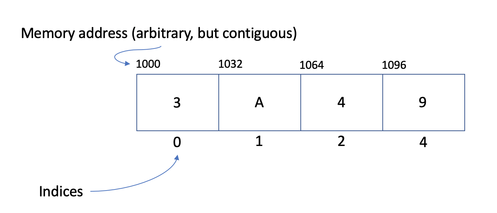

# Tuple

A tuple is an immutable data structure much like an array.

# In Memory

In memory, a tuple looks like this:



In the above diagram, each position in the tuple has a value, an index and a memory address.

- Indices increase by 1 as they ascend in position, but start at 0.
- Memory addresses above are arbitrary, but contiguous.

# Operations

A tuple supports the following operations:

- **retrieval/access/read**: obtain a value stored in the structure at a specific indexed position in the tuple.
  - O(1), constant time. A tuple variable really just records the base address of the tuple, so we know the exact memory address of the beginning of the tuple. We also know the data type of the elements in the tuple, and therefore the size of each element. Given the index of an element we wish to read, we can calculate the address of that element in _one step_: base address + sizeof(datatype) \* index. Since we can calculate this in one step for all values in the tuple, this is an O(1) constant time operation.
- **search**: find a value stored in the structure and determine the indexed position in the tuple.
  - O(n), linear time. There is no way to find a specific value in a tuple without iterating through the entire tuple (unless the tuple is sorted). Given the value we would like to find, we must iterate through each element in the tuple until finding the position of the value. Therefore, on average, this is a linear O(n) operation.
- Tuples do not support insertion/deletion because they are immutable.

# Use Cases

A tuple is useful when values in the data structure are static. It provides an immutable access-only structure which can work as a global structure if necessary.

It is not as good if insertion or deletion is necessary. This data structure does not support any changes to the elements and would not be a good fit.

# Example

```
my_tuple = (1, 2, 3, 4)
my_second_tuple = ('hi')
print(my_tuple + my_second_tuple)
>>>(1, 2, 3, 4, 'hi')
```

(c) 2018 Francesco Aiello. All rights reserved.
